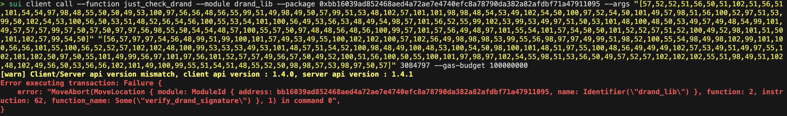

I'm trying to use the drand_lib.move. However, I don't know how to pass drand_sig and drand_prev_sig into the verify_drand_signature function as vector. The test does pass when I hardcoded the drand_sig and drand_prev_sig in it. Yet I cannot pass it through cli.

The example Drand I use https://drand.cloudflare.com/8990e7a9aaed2ffed73dbd7092123d6f289930540d7651336225dc172e51b2ce/public/3084797


```
sui client publish . --gas COIN_OBJ --gas-budget 300000000 --skip-dependency-verification
```

Example Execution Result:
Result: https://suiexplorer.com/txblock/DCDjrgpV5VqymCam9WE4hJdmneoFax2pysvzs57FRhhA?network=testnet
Created Package: https://suiexplorer.com/object/0xbb16039ad852468aed4a72ae7e4740efc8a78790da382a82afdbf71a47911095?network=testnet

Then, I tried the following, neither one of them work:

```
sui client call --function just_check_drand --module drand_lib --package 0xbb16039ad852468aed4a72ae7e4740efc8a78790da382a82afdbf71a47911095 --args "[57,52,52,51,56,50,51,102,51,56,51,101,54,54,97,98,48,55,50,50,49,53,100,97,56,56,48,56,55,99,51,49,98,49,50,57,99,51,53,48,102,57,101,101,98,98,48,54,53,49,102,54,50,100,97,52,54,50,101,49,57,98,51,56,100,52,97,51,53,99,50,102,54,53,100,56,50,53,51,48,52,56,54,56,100,55,53,54,101,100,56,49,53,56,53,48,49,54,98,57,101,56,52,55,99,102,53,99,53,49,97,51,50,53,101,48,100,48,50,53,49,57,49,48,54,99,101,49,57,57,57,99,57,50,57,50,97,97,56,98,55,50,54,54,48,57,100,55,57,50,97,48,48,56,48,56,100,99,57,101,57,56,49,48,97,101,55,54,101,57,54,50,50,101,52,52,57,51,52,100,49,52,98,101,51,50,101,102,57,99,54,50]" "[56,57,97,97,54,56,48,99,51,99,100,101,57,49,53,49,55,100,102,102,100,57,102,56,49,98,98,98,53,99,55,56,98,97,97,49,99,51,98,52,100,55,54,98,49,98,102,99,101,100,56,56,101,55,100,56,52,52,57,102,102,48,100,99,53,53,53,49,53,101,48,57,51,54,52,100,98,48,49,100,48,53,100,54,50,98,100,101,48,51,97,55,100,48,56,49,49,49,102,57,53,49,51,49,97,55,102,101,102,50,97,50,55,101,49,99,56,97,101,97,56,101,52,57,57,49,56,57,50,49,52,100,51,56,100,50,55,100,101,97,98,97,102,54,55,98,51,53,56,50,49,57,52,57,102,102,102,55,51,98,49,51,102,48,102,49,56,50,53,56,56,102,101,49,100,99,55,51,54,51,48,55,52,50,98,98,57,53,98,97,50,57]" 3084797 --gas-budget 100000000
```

```
sui client call --function just_check_drand --module drand_lib --package 0xbb16039ad852468aed4a72ae7e4740efc8a78790da382a82afdbf71a47911095 --args [57,52,52,51,56,50,51,102,51,56,51,101,54,54,97,98,48,55,50,50,49,53,100,97,56,56,48,56,55,99,51,49,98,49,50,57,99,51,53,48,102,57,101,101,98,98,48,54,53,49,102,54,50,100,97,52,54,50,101,49,57,98,51,56,100,52,97,51,53,99,50,102,54,53,100,56,50,53,51,48,52,56,54,56,100,55,53,54,101,100,56,49,53,56,53,48,49,54,98,57,101,56,52,55,99,102,53,99,53,49,97,51,50,53,101,48,100,48,50,53,49,57,49,48,54,99,101,49,57,57,57,99,57,50,57,50,97,97,56,98,55,50,54,54,48,57,100,55,57,50,97,48,48,56,48,56,100,99,57,101,57,56,49,48,97,101,55,54,101,57,54,50,50,101,52,52,57,51,52,100,49,52,98,101,51,50,101,102,57,99,54,50] [56,57,97,97,54,56,48,99,51,99,100,101,57,49,53,49,55,100,102,102,100,57,102,56,49,98,98,98,53,99,55,56,98,97,97,49,99,51,98,52,100,55,54,98,49,98,102,99,101,100,56,56,101,55,100,56,52,52,57,102,102,48,100,99,53,53,53,49,53,101,48,57,51,54,52,100,98,48,49,100,48,53,100,54,50,98,100,101,48,51,97,55,100,48,56,49,49,49,102,57,53,49,51,49,97,55,102,101,102,50,97,50,55,101,49,99,56,97,101,97,56,101,52,57,57,49,56,57,50,49,52,100,51,56,100,50,55,100,101,97,98,97,102,54,55,98,51,53,56,50,49,57,52,57,102,102,102,55,51,98,49,51,102,48,102,49,56,50,53,56,56,102,101,49,100,99,55,51,54,51,48,55,52,50,98,98,57,53,98,97,50,57] 3084797 --gas-budget 100000000
```

Example Error:


## Success with the following:

```
sui client call --function just_check_drand --module drand_lib --package 0xbb16039ad852468aed4a72ae7e4740efc8a78790da382a82afdbf71a47911095 --args "[148,67,130,63,56,62,102,171,7,34,21,218,136,8,124,49,177,41,195,80,249,238,187,6,81,246,45,164,98,225,155,56,212,163,92,47,101,216,37,48,72,104,215,86,237,129,88,80,22,185,232,71,207,92,81,163,37,224,208,37,25,16,108,225,153,156,146,146,170,139,114,102,9,215,146,160,8,8,220,158,152,16,174,118,233,98,46,68,147,77,20,190,50,239,156,98]" "[137,170,104,12,60,222,145,81,125,255,217,248,27,187,92,120,186,161,195,180,215,107,27,252,237,136,231,216,68,159,240,220,85,81,94,9,54,77,176,29,5,214,43,222,3,167,208,129,17,249,81,49,167,254,242,162,126,28,138,234,142,73,145,137,33,77,56,210,125,234,186,246,123,53,130,25,73,255,247,59,19,240,241,130,88,143,225,220,115,99,7,66,187,149,186,41]" 3084797 --gas-budget 100000000
```

```
function hexToUint8Array(hexString) {
  // Remove the "0x" prefix if present
  if (hexString.startsWith("0x")) {
    hexString = hexString.slice(2);
  }

  // Ensure the hex string has an even number of characters
  if (hexString.length % 2 !== 0) {
    throw new Error("Invalid hex string");
  }

  // Create a Uint8Array with half the length of the hex string
  const length = hexString.length / 2;
  const uint8Array = new Uint8Array(length);

  // Convert each pair of hex characters to a byte and store it in the Uint8Array
  for (let i = 0; i < length; i++) {
    const byteString = hexString.substr(i * 2, 2);
    const byte = parseInt(byteString, 16);
    uint8Array[i] = byte;
  }
  let arrayString = Array.from(uint8Array).join(", ");

  return JSON.parse(`[${arrayString}]`);
}
// ...
tx.moveCall({
        target:
          "0xbb16039ad852468aed4a72ae7e4740efc8a78790da382a82afdbf71a47911095::drand_lib::just_check_drand",
        arguments: [
          tx.pure(
            hexToUint8Array(
              "9443823f383e66ab072215da88087c31b129c350f9eebb0651f62da462e19b38d4a35c2f65d825304868d756ed81585016b9e847cf5c51a325e0d02519106ce1999c9292aa8b726609d792a00808dc9e9810ae76e9622e44934d14be32ef9c62"
            ),
            "vector<u8>"
          ),
          tx.pure(
            hexToUint8Array(
              "89aa680c3cde91517dffd9f81bbb5c78baa1c3b4d76b1bfced88e7d8449ff0dc55515e09364db01d05d62bde03a7d08111f95131a7fef2a27e1c8aea8e499189214d38d27deabaf67b35821949fff73b13f0f182588fe1dc73630742bb95ba29"
            ),
            "vector<u8>"
          ),
          tx.pure(3084797, "u64"),
        ],
      });
      await walletKit.signAndExecuteTransactionBlock({ transactionBlock: tx });
```
